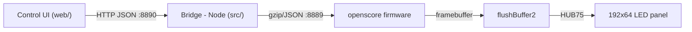

# KSCW LED Scoreboard

An open, self-hosted volleyball scoreboard stack for a **192×64 HUB75 LED panel** — the software KSC Wiedikon runs on its match scoreboard, minus the proprietary vendor firmware.

Score from any phone or tablet over the board's **own Wi‑Fi** (no venue network needed); the panel shows live points, sets, timeouts, serve, break countdowns, and an idle club crest with join‑me QR codes.

**MIT licensed** · zero‑dependency Node.js bridge + Python‑3 firmware + [`hzeller/rpi-rgb-led-matrix`](https://github.com/hzeller/rpi-rgb-led-matrix)

## How it fits together



| Path | What it is |
|---|---|
| **`src/`** | The **bridge** — a zero‑dependency Node service. Serves the control UI, exposes a small JSON API (`/api/*`), speaks the panel protocol on TCP `:8889`, and can host the board's own Wi‑Fi AP. |
| **`web/`** | The **control UI** — one self‑contained, offline‑capable HTML file (neumorphic, Lucide icons). Big +/− scoring, timeouts, subs, serve, a live 1:1 board mirror, match history + CSV/JSON export, optional scorer PIN. |
| **`firmware/openscore/`** | The **open firmware** — a clean‑room Python‑3 reimplementation of the panel renderer. Speaks the same `:8889` protocol, composites XML layouts, hands frames to flushBuffer2, and runs **headless** (writes a PNG) so it's fully testable with no panel. *Replaces the closed vendor firmware, which is not included.* |
| **`firmware/flushbuffer/`** | The **panel driver** — `flushBuffer2`, a from‑source build on `rpi-rgb-led-matrix` + `stb_image`. |
| **`docs/diy-panel/`** | **Build your own panel** — full BOM, power math, wiring, driver config (~€420 indoor). |
| **`layouts/`** | The XML scoreboard layouts (volleyball, tennis, idle crest, break). |

## Try it with no hardware

The open firmware renders every screen to a PNG, so you can see it without a panel:

```bash
cd firmware/openscore
pip install pillow
python3 selftest.py        # protocol server self-test (drives the real :8889 handshake)
python3 render_samples.py  # -> samples/*.png : scoreboard, idle crest, break clock, network info
```

## Control API (`:8890`)

`GET /api/status` · `POST /api/action` (`point` / `set` / `timeout` / `sub` / `serve` / `swap` / …) · `GET`·`POST /api/settings` · `GET /api/history` · `POST /api/idle` · `POST /api/countdown` · `POST /api/blank` · `POST /api/unlock` · `POST /api/shutdown`.
Reads are open; state‑changing calls carry an `X-Scorer-Pin` header when a scorer PIN is set.

## Status

`openscore` is a working, self‑tested skeleton — protocol‑complete and it composites every screen correctly. Roadmap: font calibration → on‑hardware verification → cutover (see `firmware/openscore/ROADMAP.md`).

## License

[MIT](LICENSE).
