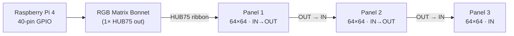
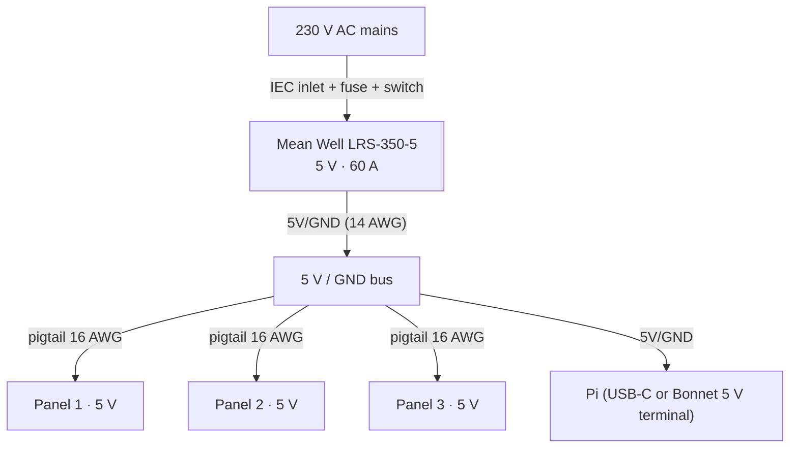

# DIY 192×64 LED scoreboard panel — build guide (KSCW)

How to build, from open parts, a scoreboard panel **functionally identical** to the
Tech4Sport LedBox that KSC Wiedikon runs today — driven by the exact same open software
stack. This is a complete-from-scratch recipe: bill of materials, power budget, wiring,
software bring-up, pitch/size trade-offs, and a build order with costs.

> Prices are **approximate, EUR, 2026**, quoted incl. shipping/VAT where a European retailer
> was available and converted ~1 USD ≈ €0.92 otherwise. Treat them as budgeting figures, not
> quotes — LED-panel and Raspberry Pi pricing both move a lot (2025–26 saw memory-driven Pi
> price rises). Verify at purchase time; sources are listed at the end.

---

## What we are replicating

The panel is a **192 × 64 RGB** display built from **3 × (64×64)** HUB75 modules in a single
chain. Everything below is measured off the actual board (`setting.ini`, the recovered
`flushBuffer` config, and `firmware/flushbuffer/flushbuffer.cc`):

| Property | Value | Notes for the DIY build |
|---|---|---|
| Resolution | **192 × 64** RGB | 3 modules × 64 wide = 192, 1 module tall = 64 |
| Panel type | Outdoor **HUB75** matrix | indoor modules are a valid, cheaper alternative — see §5 |
| Module layout | **3 × 64×64**, single chain | `chain=3`, `parallel=1` |
| Scan | **scan_mode = 1** | recovered from the vendor; verify on glass (§4) |
| Multiplexing | **1** | matches the vendor's **outdoor** panels; indoor panels usually want `0` (§4) |
| GPIO mapping | vendor uses `applicon` | **you do NOT replicate this** — use `regular` or `adafruit-hat` (see below) |
| PWM | `pwm_bits=7`, `pwm_lsb_ns=450`, `dither=2` | good, proven tuning — keep it |
| GPIO slowdown | **5** | this is a **Pi 4** value; Pi 3B+ ≈ 2, Pi 5 ≈ 4–5 with a current lib |
| Brightness | **40** (%) | scoreboard content is mostly black, so this looks bright and saves power |
| Host | Raspberry Pi | the real board is a Pi 4 |
| Refresh | ~62 fps | `flushBuffer2` reloads `buffer.png` each frame |

**About the `applicon` GPIO mapping:** the vendor's mapping is just the stock `regular` mapping
with the **E address line moved from GPIO15 to GPIO26** — a quirk of Tech4Sport's own board
wiring. A standard driver HAT already routes the address lines correctly for its own mapping,
so on a DIY build you simply select `--led-gpio-mapping=regular` (generic HAT) or
`--led-gpio-mapping=adafruit-hat` (Adafruit Bonnet). **Do not copy `applicon` onto a standard HAT.**

**What is reused vs. new (software):**

```
control UI + Node bridge   →   open firmware renderer   →   flushBuffer2   →   HUB75 panel
      (reuse as-is)              (the ONE new piece)          (reuse as-is)      (this guide)
```

- **Reused unchanged:** the Node **bridge** (`src/bridge.js`), the **control UI / appliance**
  (`src/appliance.js` + `web/`), and **`flushBuffer2`** (`firmware/flushbuffer/`), the open
  panel driver already built on hzeller's `rpi-rgb-led-matrix`.
- **The one genuinely new component** is the **open firmware renderer** — the piece that turns
  layouts into `buffer.png`, replacing Tech4Sport's closed `ledbox.py`. KSCW's in-progress
  `openscore.py` (see `firmware/openscore/`) fills exactly this role and is tracked as its
  own effort; treat "ship the open renderer" as a **separate project**, not part of this hardware build.

---

## 1. Bill of materials

Two headline configurations — an **indoor** build (recommended for a volleyball hall, §5) and
an **outdoor** build (matches the vendor exactly; also right for beach volleyball or a very
bright/glazed hall). The only differences are the panels and the enclosure.

### 1a. Raspberry Pi (the host)

| Option | ~EUR | Notes |
|---|---|---|
| **Raspberry Pi 4 Model B, 4 GB** ✅ recommended | **€65–80** | Same generation as the real board; the `slowdown_gpio=5` tuning is dialed in for it. 4 GB is plenty. |
| Raspberry Pi 3B+ | €40–50 | Works; use `--led-slowdown-gpio=2`. Cheapest, slightly less refresh headroom. |
| Raspberry Pi 5, 4 GB | €75–90 | Works with a **current** `rpi-rgb-led-matrix` (RP1 support) and `--led-slowdown-gpio=4`–`5`; newer, but re-introduces per-Pi tuning. Only pick it if you already have one. |

Buy from Berrybase, Reichelt, Pimoroni, The Pi Hut, or any authorised reseller (check
`rpilocator.com` for stock). Add a **32 GB microSD** (~€8) and a Pi heatsink/fan (~€6).

### 1b. HUB75 driver HAT

We need **one** HUB75 output driving **one chain of three** panels (`parallel=1`), so the
standard single-output HAT is exactly right — no need for a triple/parallel board.

| Option | ~EUR | Notes |
|---|---|---|
| **Adafruit RGB Matrix Bonnet** (P/N 3211) ✅ recommended | **€18–25** | ~$14.95 base. Clean level-shifting, well-documented, works out of the box with `--led-gpio-mapping=adafruit-hat`. For 64-row panels solder the on-board **address-E jumper** (pick pin `8` or `16` — analogous to the vendor's E-line quirk). Optional flicker mod: bridge GPIO4→GPIO18 to unlock `adafruit-hat-pwm`. |
| **ElectroDragon "RGB Matrix Panel Drive Board"** (active-3 / hzeller adapter clone) | €10–15 + shipping | Reputable, based directly on hzeller's active-3 adapter. Use `--led-gpio-mapping=regular`. Budget choice; longer shipping from CN. |
| Adafruit **Triple** LED Matrix Bonnet (P/N 6358) | €25–30 | Only if you later want **parallel** chains — **not needed** for our `parallel=1` layout. |

### 1c. Three 64×64 HUB75 panels

All three must be the **same model and pitch** and support chaining (each has HUB75 **IN + OUT**
and its own 5 V power pigtail).

| Option | ~EUR each | ×3 | Notes |
|---|---|---|---|
| **Indoor 64×64, P5 high-brightness** ✅ hall recommendation | €55–70 | **€165–210** | ~1000–1500 cd/m². P5 → ~960×320 mm board (§5). Sweet spot of size/brightness/cost for an indoor hall. |
| Indoor 64×64, P4 | €55–75 | €165–225 | More compact (~768×256 mm), closer viewing. |
| Indoor 64×64, P3 (e.g. Waveshare / DMX4ALL) | €60–130 | €180–390 | EU retail like DMX4ALL is ~€131 ea; AliExpress/Amazon ~€55–70. 192×192 mm/module. |
| **Outdoor 64×64, P5/P6 (vendor-equivalent)** | €90–130 | **€270–390** | ~5000 cd/m², weather-resistant, brighter for sunlit/beach venues. What the real board uses. |

Buy indoor panels from Waveshare, The Pi Hut, Pimoroni, DMX4ALL, Amazon; outdoor modules from
AliExpress LED-sign sellers or a local sign shop. **Confirm each panel is 64×64 with HUB75 (HUB75E
for 64-row) and 1/32 scan.** Buy a spare 4th panel if the budget allows — matching a single
replacement later is painful.

### 1d. 5 V power supply

| Option | ~EUR | Notes |
|---|---|---|
| **Mean Well LRS-350-5** (5 V, 60 A, 300 W) ✅ recommended | **€45–55** | ~$36 base. Comfortable headroom over the worst case (§2), even for bright outdoor panels + the Pi. Runs cool. |
| Mean Well **LRS-200-5** (5 V, 40 A, 200 W) | €35–45 | Fine for an **indoor** build at brightness 40; less margin if you ever run full-white outdoor. |
| Generic enclosed 5 V / 40–60 A | €25–35 | Cheaper, quality varies — prefer a real Mean Well for a device left on unattended. |

### 1e. Cabling, connectors, protection

| Item | ~EUR | Notes |
|---|---|---|
| HUB75 ribbon cables (chaining) | €0–8 | Usually **included** with panels; buy 2–3 spares. |
| 5 V power injection wire — **≥14 AWG / 2.5 mm²** bus + panel pigtails (16 AWG) | €10–20 | Star-wire one feed per panel (§2/§3). |
| IEC C14 inlet **with fuse + switch** | €8–15 | Mains entry; fuse per PSU rating (~3.15 A slow-blow for a 300 W PSU at 230 V). |
| Pi power: USB-C lead or a 5 V feed to the Bonnet terminal | €5–10 | Power the Pi from the same 5 V rail or its own supply. |
| Ferrules, ring terminals, cable gland, strain relief | €5–10 | |

### 1f. Frame / enclosure

| Build | ~EUR | Notes |
|---|---|---|
| **Indoor** — laser-cut ply / 3D-printed frame + tinted acrylic front + magnetic panel mounts | €30–60 | Tinted/anti-glare front raises contrast noticeably. Leave airflow for the PSU. |
| **Outdoor** — IP54+ aluminium/steel LED cabinet (empty "P-series outdoor cabinet") + polycarbonate front + gasket + rear vented box | €80–200 | Many sign shops sell empty cabinets sized to 3×(64×64). Include a front louver/diffuser for sunlight readability. |

---

## 2. Power budget

### Worst-case current (full white)

The accepted rule for HUB75 panels (Adafruit / hzeller) is **max current = panel width in
pixels × 0.12 A** at 5 V, full white, full brightness. This comes from the 1/32-scan geometry:
at any instant **2 of the 64 rows are lit** (top + bottom half), so 64 columns × 2 rows = 128
RGB pixels draw current at once, each ~0.06 A (0.02 A × R,G,B):

```
Per 64×64 panel : 128 pixels × 0.06 A          = 7.68 A  ≈ 8 A  → 38 W @ 5 V
                  (equivalently 64 wide × 0.12 A = 7.68 A)

Three panels    : 3 × 7.68 A                    = 23.0 A  ≈ 24 A → 115 W @ 5 V
```

So budget **~24 A at 5 V (~115 W)** worst case for the display. Notes:

- **Outdoor panels can pull up to ~2× on the very brightest models** — another reason to size
  the PSU generously below.
- **Brightness 40** caps the drive to ~40 %, and **real scoreboard content is mostly black**
  (a few coloured digits), so **typical** draw is only ~2–4 A total. The 24 A figure is the
  worst case a PSU must *survive*, not the normal load.
- **The Pi** adds ~1.5 A (Pi 4) to ~3 A peak (Pi 5) at 5 V if fed from the same rail.

### PSU sizing (with headroom)

```
Display worst case          ~24 A
+ Pi                          ~3 A
= peak                       ~27 A
+ 25–30 % headroom      ×1.3 ~35 A
```

A **Mean Well LRS-350-5 (5 V / 60 A)** covers this with huge margin — it will loaf even if you
run bright outdoor panels at full white, and Mean Well derates gracefully. For a strictly
**indoor** build at brightness 40, an **LRS-200-5 (40 A)** is adequate. Never size a 5 V PSU to
exactly the worst case; running a supply near 100 % shortens its life and sags the rail.

### Wire gauge, fusing, power injection

- **Never power the panels through the Pi or the HAT ribbon.** The ribbon carries logic +
  ground only. Each panel gets its own 5 V pigtail straight from the PSU.
- **Star-wire the 5 V**, one feed per panel, from the PSU's 5 V/GND terminals (or a small bus
  bar). **Do not** daisy-chain 5 V across all three panels through a single thin pigtail — that
  causes voltage droop (dim/pink far end) and is a fire risk at ~24 A.
- **Wire gauge (short runs, <0.5 m):**
  - PSU → bus / main run carrying ~24 A: **≥14 AWG (2.5 mm²)**.
  - Per-panel pigtail carrying ~8 A: **16 AWG (1.5 mm²)** is fine.
- **Fusing:**
  - Mains side: fuse in the **IEC inlet** per PSU rating (~3.15 A slow-blow for a 300 W supply at 230 V).
  - Optional 5 V side: an inline **~10 A fuse per panel feed** protects against a shorted pigtail.
- **Common ground:** bond the PSU 5 V **GND** to the Pi/HAT ground (they already share ground
  through the HUB75 ribbon; a dedicated bond is good practice with three panels).
- Keep the 5 V leads short and equal-ish length; twist/route power away from the ribbon to
  reduce noise.

---

## 3. Assembly + wiring

### Signal chain (HAT → panels)

The HAT provides one HUB75 output. Chain **HAT → Panel 1 IN → Panel 1 OUT → Panel 2 IN →
Panel 2 OUT → Panel 3 IN**. Left-to-right physical order should match the chain order (fix
orientation in software later if a panel is flipped, via `--led-pixel-mapper`).



### Power (star injection from the PSU)



### Mechanical

1. Mount the three panels edge-to-edge on a flat backer (they ship with magnet studs + screw
   holes). Keep the 64-px rows aligned so the 192×64 image is continuous.
2. Seat the Bonnet firmly on the Pi's 40-pin header. Mount the Pi + PSU in a rear vented box.
3. Run the ribbon HAT→Panel 1 with the connector orientation the panel silkscreen shows
   (arrow = data direction). Chain the rest.
4. Land all 5 V pigtails on the bus; land mains on the IEC inlet → PSU. Strain-relief the mains.

---

## 4. Software bring-up

### 4.1 Prepare the Pi

Flash **Raspberry Pi OS (Bookworm, Lite is fine)**. Then, critically for `rpi-rgb-led-matrix`,
**disable on-board audio** (its PWM hardware collides with the matrix and causes flicker):

```bash
# /boot/firmware/config.txt  → set:
dtparam=audio=off
# and blacklist the module:
echo "blacklist snd_bcm2835" | sudo tee /etc/modprobe.d/blacklist-rgb-matrix.conf
# (optional, Pi 4) dedicate a core to reduce flicker — append to /boot/firmware/cmdline.txt:
#   isolcpus=3
sudo reboot
```

### 4.2 Install the driver library and build the test tools

```bash
sudo apt update && sudo apt install -y git build-essential
git clone https://github.com/hzeller/rpi-rgb-led-matrix
cd rpi-rgb-led-matrix
make -C examples-api-use          # builds: demo, led-image-viewer, ...
```

### 4.3 The exact flags

These reproduce the vendor panel. **Pick the `--led-gpio-mapping` for your HAT** and drop the
vendor's `applicon`:

```bash
sudo ./examples-api-use/demo -D0 \
  --led-rows=64 --led-cols=64 --led-chain=3 --led-parallel=1 \
  --led-multiplexing=1 --led-scan-mode=1 \
  --led-gpio-mapping=adafruit-hat \   # Adafruit Bonnet;  use "regular" for a generic/ElectroDragon HAT
  --led-pwm-bits=7 --led-pwm-lsb-nanoseconds=450 --led-pwm-dither-bits=2 \
  --led-slowdown-gpio=5 \             # Pi 4;  Pi 3B+ → 2,  Pi 5 → 4–5
  --led-brightness=40
```

| Flag | Value | = panel property |
|---|---|---|
| `--led-rows` / `--led-cols` | `64` / `64` | one module |
| `--led-chain` | `3` | three modules in one chain → 192 wide |
| `--led-parallel` | `1` | single chain |
| `--led-multiplexing` | `1` | vendor value (outdoor panels) |
| `--led-scan-mode` | `1` | recovered scan mode |
| `--led-gpio-mapping` | `adafruit-hat` / `regular` | **your HAT**, not `applicon` |
| `--led-pwm-bits` | `7` | PWM tuning |
| `--led-pwm-lsb-nanoseconds` | `450` | PWM tuning |
| `--led-pwm-dither-bits` | `2` | PWM tuning |
| `--led-slowdown-gpio` | `5` (Pi 4) | GPIO timing |
| `--led-brightness` | `40` | brightness % |

> `flushBuffer2` **compiles in** `rows/cols/chain/parallel/scan_mode/multiplexing`; the rest it
> reads from `setting.ini`. The flags above are for the hzeller **demo binaries** you use to
> bring the panel up before wiring in the KSCW stack.

### 4.4 Calibrate on glass (important for the vendor's outdoor look)

Geometry problems are invisible over the network — you **must look at the panel**:

- **Image scrambled / wrong pixel order?** Sweep **`--led-multiplexing=`** `0`…`17` (indoor 64×64
  usually wants **`0`**; the vendor's outdoor panels want **`1`**), and try
  **`--led-scan-mode=0` vs `1`** and **`--led-row-addr-type=0`…`4`**.
- **A panel rotated/mirrored or the chain snakes?** Add **`--led-pixel-mapper="Rotate:180"`** or
  `"U-mapper"` as needed.
- **Adafruit Bonnet + 64-row panels:** solder the **address-E jumper** (pin `8` or `16`) if the
  bottom half is blank/duplicated.

### 4.5 Point the KSCW stack at it

Once the demo renders cleanly, swap in the reusable stack. The data flow is:

```
bridge / appliance  ──TCP:8889──▶  open renderer (openscore.py)  ──buffer.png──▶  flushBuffer2  ──▶  panel
```

1. Build the open panel driver for your mapping and run it:
   ```bash
   # in firmware/flushbuffer/ — build.sh patches the applicon mapping by default;
   # for a standard HAT, run the hzeller demos above, or rebuild flushBuffer2 and pass
   # your mapping via setting.ini's hardware_mapping (regular / adafruit-hat).
   ./build.sh
   sudo ./flushBuffer2 /home/pi/ledbox/www/buffer.png \
     --led-gpio-mapping=adafruit-hat --led-pwm-bits=7 --led-slowdown-gpio=5 \
     --led-pwm-lsb-nanoseconds=450 --led-multiplexing=1 --led-brightness=40 --led-pwm-dither-bits=2
   ```
2. Run the **open renderer** (the one new piece — see `firmware/openscore/`) so layouts render
   to `buffer.png`:
   ```bash
   pip install pillow
   python3 openscore.py --base-dir /home/pi/ledbox --port 8889
   ```
3. Run the **reused** bridge or the control UI, pointing `LEDBOX_HOST` at the Pi (use
   `127.0.0.1` if it is the same Pi):
   ```bash
   # headless mirror of a live match:
   MATCH_ID=123 LEDBOX_HOST=127.0.0.1 node src/bridge.js
   # or the phone-friendly control UI:
   npm run appliance      # http://<pi-ip>:8890
   ```

### 4.6 Test patterns

- **Geometry/mapping:** `demo -D0` (rotating square) with the §4.3 flags, or
  `led-image-viewer test.png`. Confirm a straight edge is straight across all three panels.
- **Power/thermal:** display a **full-white 192×64 PNG** for a few minutes and check the PSU
  temperature and for any dimming/pink tint at a panel's far edge (→ under-gauged 5 V wire).
- **End-to-end:** run the appliance, enter a score by hand, and confirm it appears — that
  exercises control UI → bridge → renderer → `flushBuffer2` → panel.

---

## 5. Pixel pitch (P-value) and indoor vs. outdoor

**Pixel pitch P = mm between adjacent LEDs.** Since each module is 64×64, one module spans
`64 × P` mm, and the full 192×64 board is `192P × 64P` mm. Smaller P = finer/denser = read
closer + more expensive per unit area; larger P = bigger/brighter/cheaper LEDs = read from
farther but coarser up close.

| Pitch | Board size (192×64) | Min. viewing dist.* | Typ. use |
|---|---|---|---|
| P2.5 | 480 × 160 mm | ~2.5 m | desktop / very close |
| P3 | 576 × 192 mm | ~3 m | small indoor |
| **P4** | **768 × 256 mm** | ~4 m | compact hall board |
| **P5** | **960 × 320 mm** | ~5 m | **standard indoor hall** |
| P6 | 1152 × 384 mm | ~6 m | large hall, farther seating |
| P8 | 1536 × 512 mm | ~8 m | big / outdoor, gets heavy |
| P10 | 1920 × 640 mm | ~10 m | large outdoor |

\* Rule of thumb: **minimum comfortable viewing distance (m) ≈ pitch (mm)**; pixels blend from
there out to tens of metres. Character legibility scales with digit height, not pitch — at P5 a
score digit ~30 px tall is ~150 mm, readable well past 30 m.

**Indoor vs. outdoor modules:**

| | Indoor 64×64 | Outdoor 64×64 (vendor uses this) |
|---|---|---|
| Brightness | ~800–1500 cd/m² | ~4000–6000 cd/m² |
| Best for | normal-lit halls | sunlit/glazed halls, beach volleyball |
| Power | lower (~4–5 A/panel white) | higher (up to ~8 A+/panel white) |
| Weather | none | water/UV resistant, front louver |
| Cost | lower | higher |
| Pixel layout | usually simple → `--led-multiplexing=0` | often multiplexed → `--led-multiplexing=1`+ (calibrate) |

### Recommended config for an indoor volleyball hall

**Three 64×64 indoor P5 high-brightness modules** → a **~960 × 320 mm** board (≈ 1 m wide),
readable from ~5 m to well across a typical hall, at a sensible price. Choose **P4** instead if
you want it more compact and seating is closer; step up to **outdoor P5/P6** if the hall has big
windows/very bright lighting or you also play **beach**. Keep the proven tuning either way
(`pwm_bits=7`, `pwm_lsb_ns=450`, `dither=2`, `brightness=40`, `slowdown_gpio=5` on a Pi 4), and
expect indoor panels to want **`--led-multiplexing=0`** (calibrate per §4.4).

---

## 6. Build order, cost, and time

### Step-by-step

1. **Order parts** (§1). Longest lead time is usually the panels — order those first; buy a
   spare panel if budget allows.
2. **Flash + prep the Pi** (§4.1): Raspberry Pi OS, `dtparam=audio=off`, blacklist audio, reboot.
3. **Bench-test one panel** on the HAT with the hzeller demo (§4.3) **before** building anything
   — confirm the mapping and (Bonnet) solder the E jumper if needed.
4. **Chain all three** and calibrate geometry on glass: multiplexing / scan-mode / pixel-mapper (§4.4).
5. **Wire power** (§2/§3): star-feed each panel from the PSU, mains via fused IEC inlet, run a
   full-white soak test and check heat + far-edge colour.
6. **Bring up the KSCW stack** (§4.5): `flushBuffer2` → open renderer → bridge/appliance; enter a
   test score end-to-end.
7. **Build the enclosure** (§1f) and mount everything; add front diffuser/louver.
8. **Final calibration + burn-in**: brightness, a live match dry-run, leave it running.

### Rough total cost

| Line | Indoor (hall) | Outdoor (vendor-equivalent) |
|---|---|---|
| Raspberry Pi 4 (4 GB) + microSD + cooling | €85 | €85 |
| RGB Matrix Bonnet | €22 | €22 |
| 3 × 64×64 panels | €190 (P5 indoor) | €300 (P5/P6 outdoor) |
| PSU (Mean Well) | €50 (LRS-350-5) | €55 (LRS-350-5) |
| Cabling / connectors / IEC + fuse | €30 | €35 |
| Frame / enclosure | €45 | €120 (IP54 cabinet) |
| **Total (approx.)** | **≈ €420** | **≈ €620** |

Budget/stretch swings: Pi 3B+ and an ElectroDragon HAT save ~€40; DMX4ALL-grade EU panels or a
pro outdoor cabinet add €100–200.

### Time estimate

- Software prep + single-panel bring-up: **~2 h**
- Chaining + on-glass calibration: **~1–2 h**
- Power wiring + soak test: **~2 h**
- KSCW stack integration + end-to-end test: **~1 h**
- Enclosure build/mount: **~4–8 h** (varies most with fabrication)

**≈ 1.5–2 days of hands-on work (~10–15 h)** — a weekend project for someone comfortable with a
Raspberry Pi — plus parts lead time.

---

## Sources (approximate, 2026)

- Adafruit RGB Matrix Bonnet — <https://www.adafruit.com/product/3211> (~$14.95); width×0.12 A power rule.
- ElectroDragon RGB Matrix Panel Drive Board — <https://www.electrodragon.com/product/rgb-matrix-panel-drive-board-raspberry-pi/>
- hzeller `rpi-rgb-led-matrix` (driver, flags, wiring) — <https://github.com/hzeller/rpi-rgb-led-matrix>
- Panels: Waveshare / The Pi Hut / DMX4ALL (indoor P2.5/P3 64×64, ~€60–131); AliExpress/Amazon (indoor P3/P4/P5 ~€55–75); AliExpress LED-sign sellers (outdoor P5/P6).
- Mean Well LRS-350-5 (5 V/60 A/300 W, ~$36) — DigiKey/Mouser/Walmart.
- Raspberry Pi pricing (2026, memory-driven rises) — <https://www.raspberrypi.com/products/raspberry-pi-5/>; stock via `rpilocator.com`.
- Measured vendor panel config — this repo: `firmware/openscore/PANEL-AND-DIY.md`, `firmware/FLUSHBUFFER.md`, `firmware/flushbuffer/flushbuffer.cc`.
